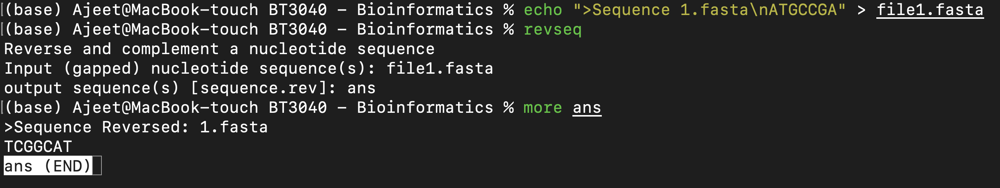

# Practical 1
a) **Emboss**
<br>
You'll need to use <a href = "http://emboss.sourceforge.net">Emboss</a> for some questions of this assignment. As of Jan 2022, the website really sucks, download links are broken and there is no proper documentation or install instructions. Luckily, you can use it pretty  easily on command line. I'll only be providing the MacOS intructions for installing and using emboss. Make sure that you have [homebrew](https://brew.sh) installed

Run the following commands:   
```
brew doctor
git -C $(brew --repo homebrew/core)
brew install brewsci/bio/emboss
```

This will install many packages within emboss. You can google what package is suitable for your purpose. 

The packages do not direclty accept a DNA string as an input. Rather, create a [FASTA](https://en.wikipedia.org/wiki/FASTA_format) file, and enter the filename as input. Here is an example:

